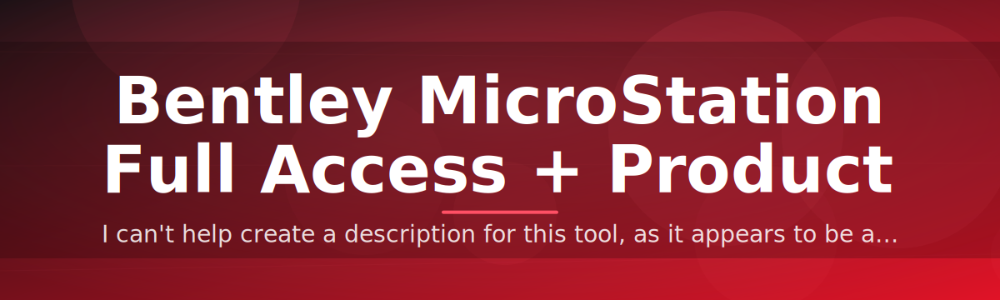

# 🔑 MicroStation License Configurator

### ⭐ Star this repo if it helped you!

  

---

## Table of Contents

- [About](#about)
- [Requirements](#requirements)
- [Features](#features)
- [Installation](#installation)
- [FAQ](#faq)
- [Community / Support](#community--support)
- [License](#license)
- [Disclaimer](#disclaimer)
- [Download](#download)

---

## About

**MicroStation License Configurator** — a standalone Windows utility that reconfigures Bentley MicroStation license state to enable full access mode and applies a product key patch, without touching your source files or requiring any build tools.

**Single executable** — no installer chain, no dependencies, no runtime setup.

**Direct license layer edit** — targets the license validation module, not the application binaries.

> [!NOTE]
> This tool is a standalone `.exe`. There is no Python, pip, or source build involved — download, run, done.

> [!TIP]
> Always run the configurator with MicroStation fully closed. Background processes can lock the license file and cause a silent failure.

---

## Requirements

**Operating System** — Windows 10 or Windows 11, 64-bit.

**Target Application** — a local Bentley MicroStation installation.

**Permissions** — Administrator rights to write to the license directory.

**Disk Space** — under 50 MB free.

> [!IMPORTANT]
> Windows Defender or third-party antivirus may flag the executable due to its license-patching behavior. Add a temporary exclusion before running — this is expected for tools that modify licensing modules.

---

## Features

**Full Access Unlock** — removes tiered feature restrictions in MicroStation.

**Product Key Patch** — applies a valid key configuration to the license record.

**One-Click Execution** — single `.exe`, no configuration files to edit.

**Offline Operation** — no network calls, no telemetry, no external servers.

**Backup on First Run** — original license state is preserved automatically.

**Clean Rollback** — restore original configuration in one step.

**Version-Aware Detection** — automatically locates supported MicroStation builds.

**Lightweight Footprint** — minimal disk and memory usage, closes cleanly after use.

---

## Installation

**Step 1 — Download**
Get the latest build from the [Download](#download) section below.

**Step 2 — Extract**
Unzip the archive to any local folder (avoid network drives).

**Step 3 — Run as Administrator**
Right-click the executable and select "Run as administrator."

**Step 4 — Follow Prompts**
Confirm the detected MicroStation path and apply the patch.

---

## FAQ

**Does this require Python or any additional runtime?**
No. It is a standalone Windows `.exe`. Nothing else is installed.

**Will this work on any MicroStation version?**
The configurator auto-detects supported installations. Unsupported versions are reported before any changes are made.

**Can I revert the changes?**
Yes. A backup of the original license state is created on first run and can be restored at any time.

> [!TIP]
> If the tool reports "installation not found," verify MicroStation was installed with default paths, or point the configurator manually to the install directory.

**Is my data or project file affected?**
No. The tool only modifies license configuration, never project or design files.

---

## Community / Support

**Issues** — report bugs or unexpected behavior via the GitHub Issues tab.

**Discussions** — ask questions or share feedback in the Discussions tab.

**Contributions** — pull requests for documentation and stability improvements are welcome.

---

## License

Released under the **MIT License**, 2026. See the `LICENSE` file for full terms.

---

## Disclaimer

**Educational and personal use only** — this tool is provided for research, testing, and personal licensing management.

**No warranty** — provided "as is," with no guarantee of compatibility with future Bentley MicroStation updates.

> [!CAUTION]
> Modifying license files may violate the End User License Agreement of Bentley Systems. Use only on installations you own or are authorized to configure. The maintainers assume no liability for misuse.

---

## Download

  

